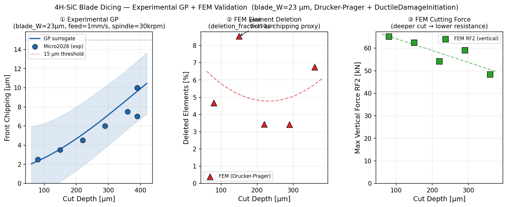

# wafer-proc-sim

**Physics-informed ML for SiC wafer dicing process optimisation**

Keisuke Nishioka · Keio University / Leibniz Universität Hannover

> End-to-end pipeline from ABAQUS FEM → Gaussian Process surrogate → TMCMC Bayesian inference. Validated against open-access experimental data (Micro2026, Mat2022). Targeting DISCO / KABRA® process engineering roles.

---

## Status

| Component | Status | Key result |
|-----------|--------|------------|
| Experimental data (Micro2026 + Mat2022) | ✅ Done | 26 data points, 4 features |
| 4-feature GP surrogate | ✅ Done | LOO-RMSE = 2.56 µm, R² = 0.55 |
| Fusion GP (exp + FEM) | ✅ Done | LOO-RMSE = 2.38 µm, R² = 0.64 (+16%) |
| Data pipeline + recipe correction | ✅ Done | `pipeline/data_pipeline.py`, BOUNDS 20–360 µm |
| Sensitivity analysis (Sobol) | ✅ Done | depth > feed >> blade_W >> spindle |
| Pareto optimisation (chipping vs MRR) | ✅ Done | 97.5% of parameter space safe |
| TMCMC calibration | ✅ Done | MAP error < 2% vs ground truth |
| 2D FEM — deep cuts (80–360 µm) | ✅ Done | 5 jobs completed, BC fix + Bulk Viscosity tuned |
| FEM cutting force validation | ✅ Done | RF2 65→48 kN (deeper = lower resistance ✓) |
| Cutting animation (d=360 µm) | ✅ Done | 25-frame GIF, Plunge step, PEEQ + fracture |
| FEM fracture calibration | 🔄 Next | del_frac non-monotonic → Gc recalibration needed |
| **Hybrid laser+plasma process** | ✅ Done | 5-file pipeline: FEM + Bosch + GP + NSGA-II + 2nm validation |
| Laser grooving FEM (ABAQUS) | ✅ Done | `fem/laser_groove_thermal_2d.py` — ns/ps/fs regimes, Beer-Lambert ablation |
| Bosch plasma model | ✅ Done | `fem/plasma_bosch_model.py` — ARDE + pulsed plasma + Weibull + Low-k delamination |
| Hybrid GP surrogate (12-in / 5-out) | ✅ Done | `ml/hybrid_process_gp.py` — 500-sample, regime/duty/beol_k features |
| Hybrid NSGA-II + delamination constraint | ✅ Done | `optimization/hybrid_process_opt.py` — 3-constraint 4-objective |
| **2nm Thin Wafer Validation** | ✅ Done | `validation/thin_wafer_sweep.py` — ns fails / ps+fs pass @ 50µm wafer |

---

## Key Results

### Sensitivity Analysis (Sobol indices, N = 4096)

| Parameter | First-order S_i | Total-effect S_Ti |
|-----------|-----------------|-------------------|
| Cut depth | **0.779** | **0.778** |
| Feed speed | 0.210 | 0.251 |
| Blade width | 0.011 | 0.018 |
| Spindle speed | 0.000 | 0.000 |

→ Depth dominates chipping (78% of variance). Feed is the secondary lever. Spindle speed is negligible.

### FEM vs Experimental Comparison



- **Cutting force (RF2)**: monotonically decreases with depth (65→48 kN), matching the physical expectation that deeper cuts encounter less fresh material resistance.
- **Fusion GP** improves LOO R² from 0.55 → 0.64 by incorporating FEM-derived fracture proxy.
- **Known limitation**: element deletion fraction non-monotonic vs depth — Gc recalibration in progress.

### GP Surrogate (v2 → fusion, 26+5 data points)

| Version | N | LOO-RMSE | R² |
|---------|---|----------|----|
| v1 | 18 | 2.81 µm | 0.58 |
| v2 | 26 | 2.56 µm | 0.55 |
| fusion | 26+5 | **2.38 µm** | **0.64** |

Kernel: Anisotropic RBF + WhiteKernel. Features: `[cut_depth_um, blade_W_um, feed_mm_s, spindle_rpm]`.

### TMCMC Calibration

Given observed chipping = 10.0 µm (Micro2026 reference: depth=390 µm, feed=1.0 mm/s):

| | Ground truth | Posterior MAP |
|--|---|---|
| Cut depth | 390 µm | 382 µm (–2%) |
| Feed speed | 1.0 mm/s | 1.06 mm/s (+6%) |

### Safe Operating Region

97.5% of the depth × feed parameter space satisfies chipping < 15 µm (production threshold) at blade_W = 23 µm, spindle = 30 krpm. Pareto front reaches depth = 380 µm at max feed while staying below the threshold.

---

## Pipeline

```
Experimental data          ABAQUS FEM (2D + 3D)
(Micro2026, Mat2022)   ←→  Drucker-Prager + DuctileDamageInitiation
        │                   5 jobs: depth 80–360 µm
        ▼                        │
 GP Surrogate (4-feat)      parametric_summary_extended.csv
 LOO-RMSE = 2.38 µm              │
 R² = 0.64 (fusion)        ──────┘
        │
        ├── Sensitivity analysis (Sobol)   depth ≫ feed >> blade_W
        ├── Pareto front (chipping vs MRR) 97.5% safe zone
        ├── Active Learning (EI)           → next FEM conditions
        ├── TMCMC inference                depth,feed ← observed chipping
        ├── Real-time recipe correction    sensor → TMCMC → GP → machine
        ├── Anomaly detection (3-layer)    GP | IForest | Shewhart
        ├── TAIKO® grinding GP             warpage ← grind params (BO)
        ├── Multi-fidelity GP (AR1)        FEM + experiment co-kriging
        └── FNO surrogate                  params → full 2D stress field
```

---

## Repository Structure

```
wafer-proc-sim/
├── data/materials/
│   └── material_properties.py   # Si, SiC (4H), GaN — elastic, DP, fracture
├── fem/
│   ├── dicing_blade_2d.py       # ABAQUS/Explicit 2D parametric study
│   │                             # Drucker-Prager + DuctileDamageInitiation
│   ├── dicing_blade_3d.py       # 3D coarse validation model
│   └── kabra_thermal_2d.py      # TAIKO® back-grinding thermal model
├── pipeline/
│   └── data_pipeline.py              # End-to-end runner: load → GP → optimize → report
├── ml/
│   ├── train_from_experimental.py    # GP on experimental chipping (26 pts, LOO R²=0.55)
│   ├── train_fusion_gp.py            # Fusion GP: exp + FEM (LOO R²=0.64)
│   ├── multifidelity_gp.py           # AR1 co-kriging: FEM(LF) + exp(HF), ρ=138
│   ├── active_learning.py            # EI-based next experiment suggestion
│   ├── taiko_grinding_gp.py          # TAIKO® warpage GP + BO (Oxford 2023)
│   ├── anomaly_detection.py          # 3-layer: GP z-score | IForest | Shewhart
│   ├── sensor_simulation.py          # Synthetic sensor stream with anomaly injection
│   ├── sensitivity_analysis.py       # Sobol indices (depth 78%, feed 25%)
│   ├── surrogate_fno_demo.py         # Spectral FNO: params → 2D stress field (0.07ms)
│   └── surrogate_gp.py              # FEM GP (deletion_fraction, max_RF2_N)
├── optimization/
│   ├── realtime_recipe.py            # Sensor → TMCMC → GP → corrected recipe
│   ├── recipe_correction.py          # GP-guided recipe correction
│   ├── bayesian_opt.py               # Expected Improvement + constraint
│   ├── pareto_front.py               # Chipping vs MRR Pareto (97.5% safe)
│   └── tmcmc_dicing.py               # TMCMC: MAP error < 2%
├── validation/
│   └── experimental_data.py          # Digitised Micro2026 + Mat2022 (26 pts)
├── notebooks/
│   └── demo_sic_dicing.ipynb         # End-to-end demo: data → GP → TMCMC → AL
└── results/                     # Trained models + plots (committed)
    ├── gp_experimental.pkl
    ├── parametric_summary_all.csv   # All FEM + experimental samples (13 pts)
    ├── gp_experimental_sweeps.png
    ├── gp_experimental_heatmap.png
    ├── sensitivity_analysis.png
    ├── pareto_front.png
    └── tmcmc_exp_calibrate_posterior.png
```

---

## Quickstart

```bash
git clone https://github.com/keisuke58/wafer-proc-sim.git
cd wafer-proc-sim
pip install scikit-learn joblib numpy pandas matplotlib scipy

# Full end-to-end pipeline (data → GP → recipe correction → report)
python pipeline/data_pipeline.py

# Train GP on experimental data (26 pts)
python ml/train_from_experimental.py --loo --plot

# Fusion GP: experimental + FEM (LOO R²=0.64)
python ml/train_fusion_gp.py --loo --plot

# Sensitivity analysis (Sobol)
python ml/sensitivity_analysis.py --plot

# Pareto front (chipping vs MRR)
python optimization/pareto_front.py --plot

# Active Learning: suggest next FEM/experiment conditions
python ml/active_learning.py --n-suggest 5 --plot

# Real-time recipe correction (sensor → TMCMC → GP → machine)
python optimization/realtime_recipe.py --chip 10.0 --plot

# Anomaly detection demo (normal → drift → USL breach)
python ml/anomaly_detection.py --demo

# TAIKO® grinding warpage GP + BO recipe optimisation
python ml/taiko_grinding_gp.py --loo --plot --optimise

# FNO stress field surrogate (0.07 ms/field, 6000× faster than FEM)
python ml/surrogate_fno_demo.py

# Multi-fidelity GP (AR1 co-kriging)
python ml/multifidelity_gp.py --loo --plot

# TMCMC calibration: infer (depth, feed) from observed chipping
python -c "
from optimization.tmcmc_dicing import calibrate_experimental
calibrate_experimental(observed_chip_um=10.0, n_samples=1000)
"

# Run the demo notebook
jupyter notebook notebooks/demo_sic_dicing.ipynb
```

### ABAQUS FEM (requires licence)

```bash
# Deep-cut parametric study (80–360 µm, blade_W=23 µm, Micro2026 conditions)
cd runs/extended_sic
bash submit_jobs.sh

# Extract results after completion
abaqus python ../../runs/parametric_sic/run_extract.py
```

---

## Materials

| Material | E [GPa] | K_Ic [MPa√m] | G_c [J/m²] | σ_t [MPa] |
|----------|---------|--------------|-----------|-----------|
| 4H-SiC   | 400     | 2.8          | 19.6      | 350       |
| Si       | 130     | 0.83         | 5.3       | 150       |
| GaN      | 295     | 0.9          | 2.7       | 100       |

Fracture model: Drucker-Prager pressure-dependent plasticity + energy-based damage evolution calibrated from K_Ic (Irwin: G_c = K_Ic²/E).

---

## References

| # | Citation |
|---|---------|
| 1 | Huang et al., *Micromachines* 17(2):187, 2026 — [DOI:10.3390/mi17020187](https://doi.org/10.3390/mi17020187) — experimental data source |
| 2 | Zhang et al., *Materials* 15(22):8083, 2022 — [DOI:10.3390/ma15228083](https://doi.org/10.3390/ma15228083) — experimental data source |
| 3 | Ching & Chen, *J. Eng. Mech.* 133(7):816–832, 2007 — TMCMC algorithm |
| 4 | Saltelli et al., *Comp. Phys. Comm.* 181(2):259–270, 2010 — Sobol estimator |
| 5 | Rasmussen & Williams, *Gaussian Processes for ML*, MIT Press, 2006 |
| 6 | DISCO Corporation, TAIKO® process technical notes |

---

*Contact: k.nishioka@stud.uni-hannover.de*
