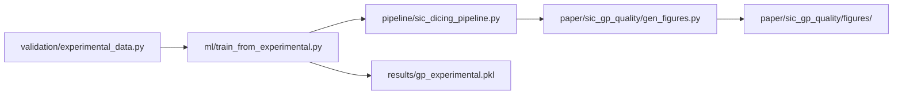

# Architecture — Core Paper Spine

`wafer-proc-sim` is organized around one reproducible research path, with optional extensions for portfolio demos.

## Core data flow



## Core modules

| Stage | Module | Role |
|-------|--------|------|
| Data | `validation/experimental_data.py` | Curated Micro2026 + Mat2022 chipping dataset with quality grades A–D |
| Surrogate | `ml/train_from_experimental.py` | Heteroscedastic GP with per-point noise from data quality |
| Pipeline | `pipeline/sic_dicing_pipeline.py` | GP + EnKF blade-wear tracking + recipe optimization |
| Figures | `paper/sic_gp_quality/gen_figures.py` | Journal figures 1–2 |
| Tests | `tests/test_paper_metrics.py` | LOO RMSE / R² regression against README claims |

## Reproduce

```bash
./scripts/reproduce_paper.sh
# or
pip install -e ".[dev]"
pytest tests/test_paper_metrics.py -v
```

## Extensions

Industry models (TEL, Keyence, DISCO portfolio, market sims) live under `fem/`, `pipeline/`, and `optimization/` but are **not** required for paper reproduction. See [TIERS.md](TIERS.md) and [../fem/README.md](../fem/README.md).