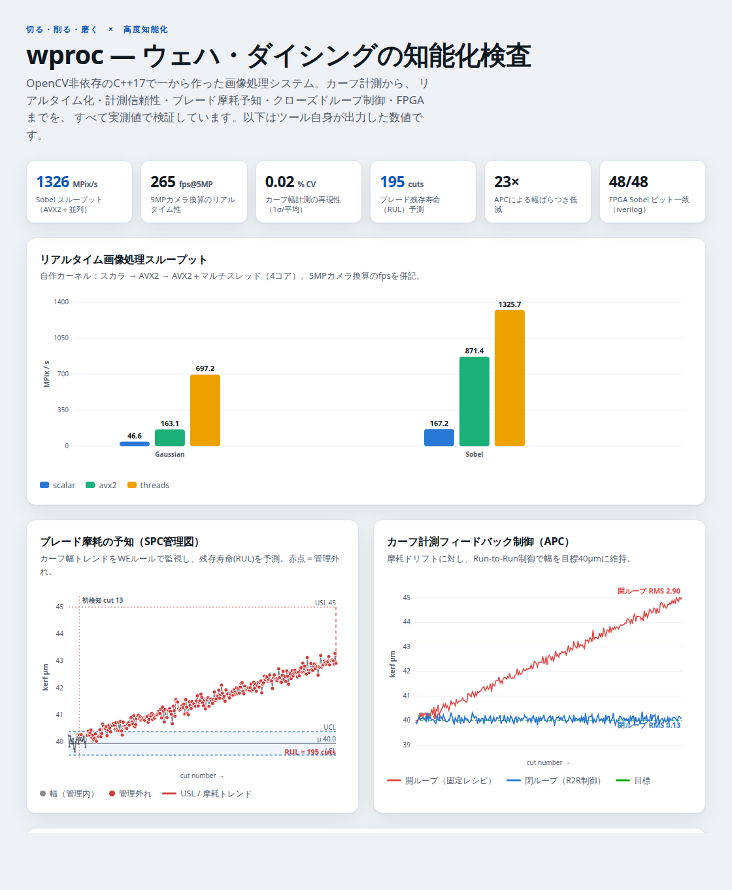

# wproc — C++ dicing-kerf image-inspection toolkit

A dependency-free **C++17 image-processing system** for inspecting wafer
dicing streets (kerfs): it measures kerf width to sub-pixel accuracy and detects
chipping defects along the cut walls, then emits a machine-readable report and an
annotated overlay image.

Built from scratch with **no OpenCV / no third-party libraries** — only the C++
standard library and CMake. The image algorithms (Gaussian smoothing, Sobel
gradients, Otsu thresholding, binary morphology, connected-component labeling)
are implemented directly, which keeps the build portable to any machine with a
C++ compiler and demonstrates the underlying computer-vision math end to end.

## 📊 Live results (GitHub Pages)

[](https://keisuke58.github.io/wafer-proc-sim/)

A published portfolio site visualizing the toolkit's **own measured results**.
The landing page collects a gallery of every figure the analysis scripts emit
(vision inspection, FEM/physics models, blade-wear reliability, and the
optimization/surrogate R&D), and links to two interactive pages: the intelligent
inspection dashboard (real-time throughput, the SPC blade-wear control chart with
RUL prediction, open-vs-closed-loop APC regulation, the full-wafer yield map) and
the annotated kerf-inspection walkthrough. Numbers are emitted by the C++ tools;
charts use a CVD-validated palette with light/dark themes and hover tooltips.

- **Live landing page:** https://keisuke58.github.io/wafer-proc-sim/
- **Inspection dashboard:** https://keisuke58.github.io/wafer-proc-sim/dashboard.html
- **Grinding / thinning dashboard:** https://keisuke58.github.io/wafer-proc-sim/grind.html
- **Laser-processing dashboard:** https://keisuke58.github.io/wafer-proc-sim/laser.html
- **Kerf explainer page:** https://keisuke58.github.io/wafer-proc-sim/kerf_annotated.html
- Source committed at [`docs/landing.html`](docs/landing.html),
  [`docs/wproc_dashboard.html`](docs/wproc_dashboard.html), and
  [`docs/kerf_annotated.html`](docs/kerf_annotated.html).

## What it does

Given a grayscale scribe-line image (a dark kerf channel on a brighter silicon
substrate), the pipeline:

1. **Denoises** with a separable Gaussian blur.
2. **Locates the two kerf walls** from the signed Sobel-x column projection —
   the strongest negative slope is the left wall, the strongest positive slope
   the right wall — refined to sub-pixel precision by parabolic interpolation.
3. **Measures kerf width** in microns via a calibrated `um_per_px` scale.
4. **Detects chipping** by Otsu-thresholding the dark regions outside the kerf
   band, cleaning specks with morphological opening, and labeling connected
   components; each chip is measured for protrusion depth and area.
5. **Applies spec limits** (nominal width ± tolerance, max chip size) and returns
   a `pass` / `fail` verdict as JSON plus an annotated overlay.

## Architecture

```
include/wproc/         public headers (one module per concern)
  image.hpp            Image (float) / ColorImage (RGB) containers
  io.hpp               PGM/PPM (Netpbm) read & write
  filters.hpp          Gaussian blur, Sobel gradient
  threshold.hpp        Otsu threshold + binarization
  morphology.hpp       erode / dilate / open / close
  connected.hpp        connected-component labeling (union-find)
  draw.hpp             annotation primitives
  pipeline.hpp         extensible Stage / Pipeline abstraction
  kerf_inspect.hpp     domain inspector (walls, chips, spec verdict, JSON)
src/                   implementations
apps/
  gen_synthetic.cpp    synthetic test-image generator (repeatable, no data)
  kerf_inspect_main.cpp CLI front-end
tests/
  test_imgproc.cpp     unit tests (ctest)
```

The design is **extension-first**: new processing steps implement the `Stage`
interface (`pipeline.hpp`) and are appended to a `Pipeline` without touching the
core. Metrology scale and spec limits are all parameters (`KerfInspector::Params`).

## Build

```bash
cmake -S . -B build -DCMAKE_BUILD_TYPE=Release
cmake --build build -j
ctest --test-dir build --output-on-failure
```

Requires only CMake ≥ 3.16 and a C++17 compiler.

## Run (end to end, no external data)

```bash
# 1. Generate a synthetic scribe-line image (40 µm kerf, small chip)
./build/gen_synthetic kerf.pgm --width-um 40 --chip-um 1.5

# 2. Inspect it against a spec, writing a JSON report + annotated overlay
./build/kerf_inspect kerf.pgm \
    --um-per-px 0.5 --nominal-um 40 --tol-um 5 --max-chip-um 5 \
    --annotate kerf_annotated.ppm
```

Example report:

```json
{
  "status": "ok",
  "found": true,
  "left_wall_px": 159.34,
  "right_wall_px": 240.62,
  "width_um": 40.64,
  "confidence": 1.0,
  "pass": true,
  "max_chip_um": 1.17,
  "chip_count": 1,
  "chips": [ { "id": 1, "side": "left", "protrusion_um": 1.17, "area_um2": 12.5 } ]
}
```

The process exit code is the verdict: **0 = pass**, **1 = fail / no kerf**,
so the tool drops straight into a shell or CI pass/fail gate.

## Inputs / outputs

- **Input:** 8-bit PGM (`P2` ASCII or `P5` binary).
- **Report:** JSON on stdout.
- **Overlay:** PPM (`P6`) — green wall lines; chip boxes colored yellow
  (in-spec) or red (over the max-chip limit), with a marker at each centroid.

## Optional backends (auto-detected by CMake)

All three are optional: the core library stays dependency-free, and each
backend is built only when its toolkit is found.

### Qt6 GUI viewer (`kerf_viewer`)

Interactive inspection: open a PGM, tune the spec parameters live, see the
annotated overlay, a PASS/FAIL verdict, and a per-chip table; save the
annotated PNG and JSON report. Built when Qt6 Widgets is found
(`WPROC_BUILD_GUI`, default ON).

```bash
./build/kerf_viewer kerf.pgm            # interactive
# headless self-test — renders off-screen, saves a screenshot, prints JSON:
QT_QPA_PLATFORM=offscreen ./build/kerf_viewer --selftest shot.png kerf.pgm
```

### OpenCV backend + parity test (`wproc_cv`)

`wproc::cv_backend::{gaussian_blur, sobel, otsu_threshold}` implement the same
operations with OpenCV (`WPROC_WITH_OPENCV`, default ON). The `cv_parity`
ctest cross-validates the from-scratch kernels against OpenCV on a noisy
synthetic kerf scene: Gaussian and Sobel agree to float rounding noise
(max |diff| ~1e-4 on a 0–255 scale) and Otsu picks the identical threshold.

### CUDA backend (`wproc_cuda`)

`wproc::cuda_backend::{gaussian_blur, sobel}` run the separable Gaussian and
3x3 Sobel on the GPU with the same border/radius conventions as the CPU path
(`WPROC_WITH_CUDA`, default ON; compiled only when `check_language(CUDA)`
finds a toolkit — machines without CUDA skip it with a status message).

## Performance, metrology & machine-vision layers

### Real-time filters + benchmark (`bench`)

`wproc::simd::{gaussian_blur, sobel}` add AVX2/FMA (8 floats/lane, scalar
borders) and row-tiled multithreaded variants, bit-parity with the scalar path
(`simd_parity` test). The `bench` app reports throughput and camera frame rate:

```bash
./build/bench --width 2048 --height 2048 --iters 7
```

Measured on a 4-core x86 (2048×2048): Gaussian **46.6 → 697 MPix/s** (15×,
139 fps @ 5 MP); Sobel **167 → 1326 MPix/s** (265 fps @ 5 MP).

### Metrology — repeatability & calibration (`wproc/metrology.hpp`)

- `metro::repeatability(...)` inspects N noisy realizations of a scene and
  reports kerf-width mean, **1-σ spread**, min/max, and CV% (Gage-R&R-style
  precision; measured CV ≈ 0.02 % on a synthetic kerf).
- `metro::estimate_um_per_px(...)` recovers the pixel scale from a periodic
  calibration target via the dominant autocorrelation period of the signed
  Sobel-x projection, making width measurements traceable.

### Machine-vision front-end — skew & multi-street (`wproc/street_detect.hpp`, OpenCV)

- `vision::estimate_skew_deg` / `deskew` — find the street orientation
  (Canny + Hough) and straighten the image; skew round-trips to ~0° after
  deskew.
- `vision::detect_streets` — locate every dark street centre across the field,
  turning the single-kerf inspector into a full-field front-end.

### Predictive blade-wear monitoring (`wproc/spc.hpp`, `wproc/blade_health.hpp`)

Turns a stream of kerf-inspection results into a maintenance signal — the
"knowing" half of DISCO's cut-grind-polish story:

- `spc::Chart` — statistical process control with the Western Electric run
  rules (1 pt beyond 3σ; 2/3 beyond 2σ; 4/5 beyond 1σ; 8 on one side) over
  standardized kerf-width values.
- `blade::Monitor` — feeds each cut through the chart and a running
  least-squares trend, then reports a **wear index** and **remaining useful
  life (RUL)** in cuts until width or chipping crosses its spec limit.

On a synthetic 0.01 µm/cut drift the monitor recovers the slope, SPC flags the
drift early, and RUL predicts the spec crossing (~195 cuts out at cut 300); a
stable blade reports RUL ≫ 1000 and no replacement. (`blade_health` test.)

### Closed-loop kerf regulation — run-to-run APC (`wproc/apc.hpp`)

The "doing" half: feed the measured kerf width back into the recipe.
`apc::R2RController` is a run-to-run EWMA controller — it tracks the process
offset and sets the next feed so the predicted width lands on target, rejecting
the slow drift a fixed recipe can't. In simulation against a drifting plant
(0.02 µm/cut wear), closed-loop RMS error is **0.13 µm vs 2.9 µm open-loop**
(≈23× tighter), with the feed automatically backing off to compensate.
(`apc` test.)

### Stealth-dicing subsurface inspection (`wproc/stealth_ir.hpp`)

For DISCO's laser (stealth) dicing, silicon is IR-transparent so a transmission
cross-section shows the internal modified (SD) layers and any cracks. `stealth::
inspect_stealth` locates the SD layers from the row-projection peaks, reports
their **count and pitch**, and measures **crack propagation** from the top layer
toward the wafer surface (flagging cracks that reach it). On a synthetic 3-layer
IR image it recovers the layers and 20 px pitch, measures an 18 px crack, and
distinguishes a surface-reaching crack. (`stealth` test.)

### Full-wafer defect map & yield binning (`wproc/wafer_map.hpp`)

Aggregates per-die inspection results into a wafer map: `wafer::classify` bins
each die in a grid as inside/outside the round wafer and pass/fail against a
spec, then reports overall **yield** and a **centre-vs-edge** zone breakdown that
exposes edge-ring signatures. Renders an ASCII map and a color wafer map. On a
synthetic edge-heavy chipping pattern it finds ~1264 dies inside a 40×40 grid
with 100% centre yield vs 28% edge yield (58.9% overall). (`wafer_map` test.)

### Back-grind / thinning intelligence (`wproc/grind_*.hpp`)

The grinding-side counterpart to the dicing stack, covering wafer **thinning**
(DGP/DFG back-grind and the DBG/TAIKO thin-wafer flows). Four cooperating
pieces, all pure C++17 with tests:

- **Thickness metrology** (`grind_metrology.hpp`) — from a thickness map over the
  wafer disk it fits a least-squares reference plane and reports **TTV**, **WARP**
  (de-tilted peak-to-valley), **BOW** (centre deflection), sigma and uniformity,
  plus a diverging thickness color map. On a synthetic thinned wafer: TTV 6.5 µm,
  WARP 2.9 µm, BOW −0.6 µm, 98.6% uniformity.
- **Surface inspection** (`grind_surface.hpp`) — the gradient **structure tensor**
  recovers grinding-mark direction and coherence; the high-pass residual gives a
  roughness Ra proxy and an **SSD index** (subsurface-damage energy fraction),
  with an SSD hotspot heat map.
- **Infeed APC** (`grind_control.hpp`) — a run-to-run EWMA controller trims the
  infeed each wafer so the final thickness holds target through wheel dulling.
  On a 300-wafer dulling run it cuts thickness RMS from **26 µm (open loop) to
  0.65 µm**.
- **Wheel health + economics** (`grind_control.hpp`) — fits the grinding-force
  trend to predict **wafers-until-dress (RUL)** with a G-ratio proxy, and rolls
  throughput / yield / consumables into cost per wafer and per good die.

Run the end-to-end demo (writes two color figures, prints all metrics as JSON):

```bash
./build/grind_demo --thickness thickness.ppm --ssd ssd.ppm
```

Live dashboard: <https://keisuke58.github.io/wafer-proc-sim/grind.html>.
(`grind_metrology`, `grind_surface`, `grind_control` tests.)

### Laser-processing intelligence (`wproc/laser_*.hpp`)

The laser-processing arm — stealth dicing, ablation grooving, and KABRA-style
SiC-ingot slicing. Pure C++17 with tests:

- **Ablation-groove inspection** (`laser_groove.hpp`) — from a top-view image,
  the groove width, a depth proxy, the HAZ transition width, and a debris/spatter
  index, with an annotated overlay and PASS/FAIL. Synthetic groove: width 19.5 µm,
  HAZ 4.0 µm/side, debris 0.11% → PASS.
- **Stealth SD-layer + HAZ** (`laser_sd.hpp`) — extends `stealth_ir`: SD-layer
  count and pitch uniformity, HAZ thickness, and a surface-crack risk from the
  cross-section IR image (3 layers, 100% pitch uniformity, crack clear of the
  surface → PASS).
- **Pulse-energy APC + optics health** (`laser_control.hpp`) — a run-to-run EWMA
  controller holds ablation depth on target through optics degradation (depth RMS
  **3.5 µm → 0.17 µm**), and an optics-power trend predicts **shots-until-service**
  (RUL ≈ 200).
- **KABRA SiC-ingot slicing** (`laser_kabra.hpp`) — wafers-per-ingot, material
  utilisation, and cost per wafer for laser slicing vs. diamond-wire sawing
  (**66 vs. 50** wafers from a 30 mm ingot, **−20%** per wafer), plus separation-
  layer depth-uniformity grading.

Run the end-to-end demo (writes two color figures, prints all metrics as JSON):

```bash
./build/laser_demo --groove groove.ppm --sd sd.ppm
```

Live dashboard: <https://keisuke58.github.io/wafer-proc-sim/laser.html> ·
explainer: <https://keisuke58.github.io/wafer-proc-sim/laser_explained.html>.
(`laser_groove`, `laser_control`, `laser_kabra`, `laser_sd` tests.)

### FPGA — streaming 3×3 Sobel (`fpga/`)

A synthesizable line-buffer Verilog Sobel core (`sobel3x3.v`, one pixel/clock,
zero-padded stream) with a self-checking testbench that compares every output
bit-exact against an independent reference. Run with Icarus Verilog:

```bash
bash fpga/run_sim.sh    # iverilog + vvp; prints "TB PASS"
```

## CLI reference

`gen_synthetic <out.pgm> [--width-um W] [--chip-um D] [--noise S] [--seed N]`

`kerf_inspect <in.pgm> [--um-per-px U] [--nominal-um N] [--tol-um T]
[--max-chip-um C] [--blur S] [--annotate out.ppm] [--quiet]`
